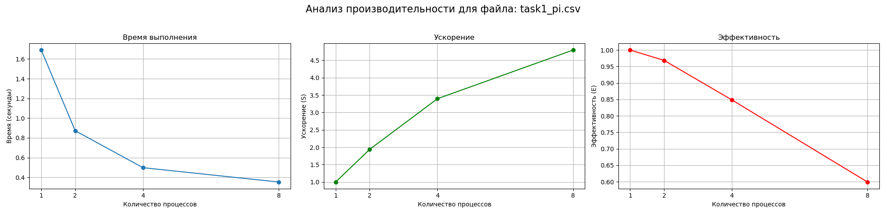
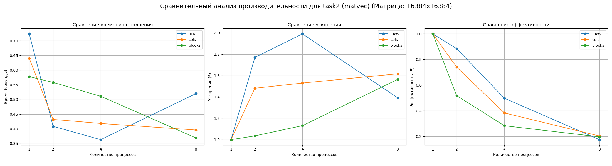
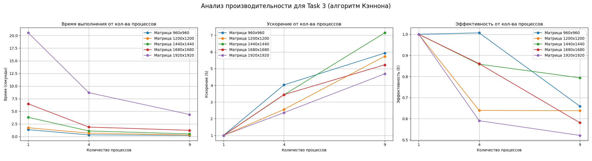

# Лабораторная работа "Параллельное программирование с использованием MPI"

Этот репозиторий содержит отчет о лабораторной работе, посвященной анализу производительности параллельных алгоритмов с использованием технологии MPI.

## Структура репозитория

- **Tasks**: Исходный код на языке C для каждой из задач.
- **Scripts**: Скрипты на Bash для компиляции и запуска MPI-программ.
- **Results**: CSV-файлы с данными о времени выполнения и PNG-изображения с графиками.

---

## Задача 1: Вычисление числа π методом Монте-Карло

### Цель
Оценить производительность и масштабируемость параллельного алгоритма вычисления числа π методом Монте-Карло.

### Результаты и анализ
Эксперимент проводился для `100,000,000` точек на 1, 2, 4 и 8 процессах. Алгоритм заключался в разделении общего числа итераций между процессами с последующей агрегацией результатов через `MPI_Reduce`.

**Данные о производительности (`Results/task1_pi.csv`):**

| Processes | Pi_Value | Time_Seconds |
|:---------:|:--------:|:------------:|
| 1         | 3.141718 | 1.690104     |
| 2         | 3.141446 | 0.872335     |
| 4         | 3.141618 | 0.497873     |
| 8         | 3.141628 | 0.352593     |

**График производительности:**



**Анализ:**
Результаты демонстрируют отличное ускорение, близкое к линейному. Удвоение числа процессов приводит к сокращению времени выполнения почти в два раза. Это говорит о том, что задача является легко распараллеливаемой (embarrassingly parallel), а коммуникационные издержки (одна операция `MPI_Reduce` в конце) минимальны по сравнению с объемом вычислений.

---

## Задача 2: Умножение матрицы на вектор

### Цель
Сравнить эффективность трех различных подходов к распараллеливанию умножения матрицы на вектор: по строкам, по столбцам и по блокам.

### Результаты и анализ
Все три метода были протестированы на матрице размером **16384x16384**.

**1. Разделение по строкам:** Матрица делится на горизонтальные полосы. Каждый процесс вычисляет свою часть итогового вектора.

| Processes | Matrix_Rows | Matrix_Cols | Time_Seconds |
|:---------:|:-----------:|:-----------:|:------------:|
| 1         | 16384       | 16384       | 0.723362     |
| 2         | 16384       | 16384       | 0.408712     |
| 4         | 16384       | 16384       | 0.363427     |
| 8         | 16384       | 16384       | 0.519973     |

**2. Разделение по столбцам:** Матрица делится на вертикальные полосы. Каждый процесс вычисляет частичный вектор-результат, которые затем суммируются.

| Processes | Matrix_Rows | Matrix_Cols | Time_Seconds |
|:---------:|:-----------:|:-----------:|:------------:|
| 1         | 16384       | 16384       | 0.640182     |
| 2         | 16384       | 16384       | 0.432253     |
| 4         | 16384       | 16384       | 0.418507     |
| 8         | 16384       | 16384       | 0.396027     |

**3. Блочное разделение:** Матрица и процессы организуются в 2D-решетку для более сбалансированного распределения данных и вычислений.

| Processes | Matrix_Rows | Matrix_Cols | Time_Seconds |
|:---------:|:-----------:|:-----------:|:------------:|
| 1         | 16384       | 16384       | 0.577741     |
| 2         | 16384       | 16384       | 0.558131     |
| 4         | 16384       | 16384       | 0.510905     |
| 8         | 16384       | 16384       | 0.369343     |

**Сравнительный график и анализ:**



**Анализ:**
- **Блочное разделение** показывает наилучшую и наиболее стабильную масштабируемость, особенно на 8 процессах. Этот метод, хоть и сложнее в реализации, выигрывает за счет сбалансированной нагрузки и эффективного использования коммуникационной топологии.
- **Разделение по строкам** дает хорошее ускорение на 2 и 4 процессах, но его производительность резко падает на 8. Это, вероятно, связано с тем, что операция `MPI_Gatherv` становится "бутылочным горлышком" при сборе большого количества мелких фрагментов данных на корневой процесс.
- **Разделение по столбцам** демонстрирует умеренное, но стабильное ускорение. Его производительность ограничивается финальной операцией `MPI_Reduce`, которая требует суммирования полных векторов, что создает значительную коммуникационную нагрузку.

**Вывод:** Для данной задачи блочная декомпозиция является наиболее предпочтительным методом, так как она лучше всего масштабируется с ростом числа процессов.

---

## Задача 3: Умножение матриц по алгоритму Кэннона

### Цель
Реализовать и оценить производительность алгоритма Кэннона для параллельного умножения матриц на двумерной процессорной решетке.

### Результаты и анализ
Алгоритм тестировался на 1, 4 и 9 процессах (решетки 1x1, 2x2, 3x3) для матриц различных размеров. Метод основан на итеративных локальных перемножениях блоков с их последующим циклическим сдвигом по строкам и столбцам решетки.

**Данные о производительности (`Results/task3_cannon.csv`):**

| Processes | Matrix_Size | Time_Seconds |
|:---------:|:-----------:|:------------:|
| 1         | 960         | 1.360362     |
| 4         | 960         | 0.337852     |
| 9         | 960         | 0.229290     |
| 1         | 1200        | 1.747272     |
| 4         | 1200        | 0.682911     |
| 9         | 1200        | 0.304229     |
| 1         | 1440        | 3.812411     |
| 4         | 1440        | 1.110279     |
| 9         | 1440        | 0.533612     |
| 1         | 1680        | 6.481099     |
| 4         | 1680        | 1.882660     |
| 9         | 1680        | 1.239280     |
| 1         | 1920        | 20.530923    |
| 4         | 1920        | 8.688535     |
| 9         | 1920        | 4.378169     |

**Графики производительности, ускорения и эффективности:**



**Анализ:**
Графики наглядно демонстрируют высокую эффективность алгоритма Кэннона.

- **Время выполнения** (левый график) закономерно сокращается с увеличением числа процессов для всех размеров матриц, что подтверждает пользу распараллеливания.
- **Ускорение** (центральный график) близко к идеальному (линейному) для матриц среднего размера (например, 1440x1440, зеленая линия), где на 9 процессах достигается почти 7-кратное ускорение. Для самых больших матриц ускорение несколько замедляется, что указывает на рост коммуникационных издержек.
- **Эффективность** (правый график) показывает, какая доля ресурсов процессоров идет непосредственно на полезные вычисления. Для 4 процессов эффективность очень высока (близка к 1.0), но при переходе к 9 процессам она заметно снижается. Это классическая картина масштабируемости: с ростом числа процессов доля времени, затрачиваемого на коммуникации между ними, увеличивается по сравнению со временем вычислений. Особенно это заметно для матриц меньшего размера, где объем вычислений на каждом процессе невелик.

**Вывод:** Алгоритм Кэннона отлично масштабируется, но его эффективность зависит от соотношения размера задачи и количества процессов. Для достижения максимальной производительности важно поддерживать баланс, при котором вычислительная нагрузка на каждый процесс значительно превышает издержки на обмен данными.

---

## Как запустить

1.  **Склонировать репозиторий и перейти в директорию:**
    ```bash
    git clone https://github.com/VladZF/MPI_Lab.git && cd MPI_Lab
    ```

2.  **Запустить все тесты:**
    Скрипт `launch.sh` последовательно выполнит все задачи.
    ```bash
    ./launch.sh
    ```

3.  **Сгенерировать графики:**
    После выполнения тестов скрипт `plots.py` создаст графики на основе полученных `.csv` файлов.
    ```bash
    python3 plots.py
    ```